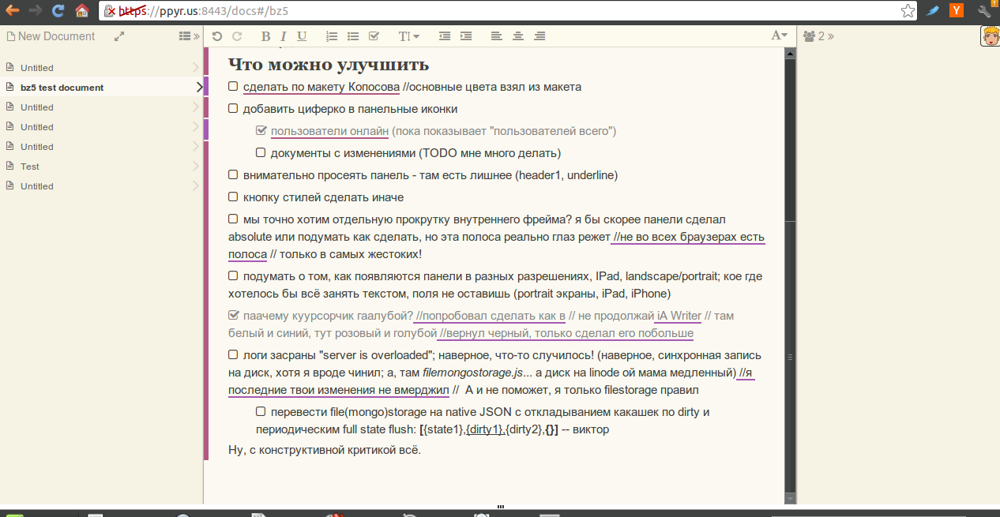

# Citrea/Papyrus

A CRDT-based collaborative editor engine of letters.yandex.ru (2012, historical)

Back in 2012, neither Quill nor ProseMirror existed. CRDTs were "mad science".
A tiny band of brave souls made a collaborative editor for Yandex Mail (http://mail.ya.ru).
The inner engine was Causal Trees CRDT (RGA family algo, array-hosted, see http://www.ds.ewi.tudelft.nl/~victor/).
As a core optimization technique, the papyrus engine stored Lamport ids as tuples of unicode characters, so the metadata 
moved around as plain strings, not JSON.
Notably, the code features a little formal address language that is essentially a precursor of RON (see http://github.com/gritzko/ron).
Pieces of a document are addressable, hence cacheable.
All recalculations are incremental, all DOM updates are also incremental.

The engine was created by @gritzko, @abalandin in 2011-2012.

For a more detailed description of the technology, see [story.md][s].

[s]: ./story.md
