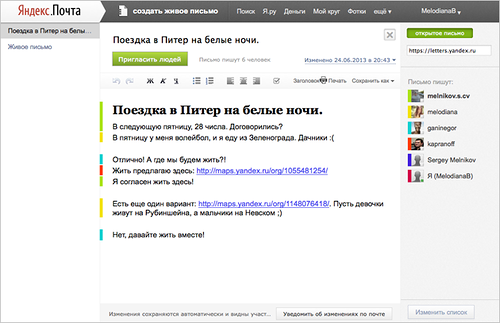

#   Papyrus: rich text CRDT from 2012

This text is mostly a reply to the Ink&Switch [Peritext project][p] article.
As it turned out, the algorithms they devised are very close to what I developed for the [Papyrus][c] real-time editor circa 2012. Actually, I tried different algorithms at the time (also, very close to what Ink&Switch did) and settled more or less on the same thing. Why is it worth mentioning today? Well, the editor worked in production for years and it had interesting internal machinery and a ton of optimizations.

[p]: https://www.inkandswitch.com/peritext/
[c]: https://github.com/gritzko/citrea-model/

So, it was in 2011-2012, before the React era, but JavaScript engines were quite decent already. Google's v8 was three years old. The code used regexes for most of its heavy-lifting because regexes compile directly into machine code in most browsers. The technique is generally described in the 2010 [Causal Trees CRDT][t] article. I don't recommend it these days, as JavaScript got a great deal of other performance features in the past 10 years. Frankly, these days I [wouldn't recommend JavaScript][w] at all. But, back to Papyrus. Its text engine ran perfectly on the server as well (thanks node.js). That allowed for server-side pre-rendering and client-side re-hydration (that is not a recent invention, contrary to some beliefs).

[t]: https://www.researchgate.net/publication/221367739_Deep_hypertext_with_embedded_revision_control_implemented_in_regular_expressions
[w]: https://webassembly.org/

Enough of preamble, how did it work? Especially, the rich text? The text was stored as a *weave*, a string consisting of all the characters that ever existed in the document. So, any historical version is a subsequence of the weave. There is a very nice [explanation of Causal Trees and weaves][a] by Alexei "archagon" Baboulevich. So, all the versioning and merge and undo/redo functionality is based on the weave. For performance reasons, the document's weave was split into paragraphs.

[a]: http://archagon.net/blog/2018/03/24/data-laced-with-history/

But the Causal Tree machinery implements plain text only. Newlines can become paragraph breaks, but that's about it. How did we upgrade that to rich text? Papyrus implements all the structural and inline formatting as a separate *overlay*. How an *overlay* works? With CRDT, each symbol has its unique id. That id is not always stored explicitly, but it can be derived. Differently from text offsets/positions, ids are not affected by edits. That is the superpower of a CRDT text: everything is addressable. Hence, there is no need for embedded markup, like with Markdown or HTML. The markup might live as a separate overlay referencing text ranges! That is an extremely powerful approach. Ovelays can be activated and deactivated, generated, stored, and so on.

The Papyrus editor renders through HTML, so all the formatting overlays eventually end up as one of four HTML markup types: 

 1. HTML attributes (e.g. href)
 2. CSS attributes (e.g. font-family)
 3. CSS classes
 4. structural block stacking (lists, headers, etc)

Structural formatting records point to paragraphs, while inline formatting points to text ranges. The renderer walks the text and the formatting, producing HTML. Easy! Actually, not. There are two invisible sagas here: intention preservation and performance. Regarding the former, the Peritext paper explains the subject pretty well. For example:

  > That is, the text inserted before the bold span becomes non-bold, and the text inserted after the bold span becomes bold. The general rule here is that an inserted character inherits the bold/non-bold status of the preceding character. The same applies to most types of character formatting, including italic, underline, font, font size, and text color. However, if text is inserted at the start of a paragraph, where there is no preceding character in the same paragraph, then it inherits the formatting of the following character.

Papyrus did that slightly differently, e.g. it considered `'\n'` to be the first (invisible) symbol of the paragraph, but the effect was basically the same, so that is not worth studying.

Compared to the Peritext approach, Papyrus cut a couple corners. First, Papyrus formatting ranges always used strictly last-write-wins merge logic. Second, there was no distinction between left and right attachment points and all formatting ranges worked the same way. For example, links grow at the end, exactly like bold or italic ranges. That way, every formatting range was a mathematically nice semi-open [b,e) interval. But MS Word does it differently (for a currently unknown reason). In my opinion, copying that leads into the legacy behavior trap: a "business user" will demand every MS Word feature to be implemented exactly as in MS Word. Google Docs is a good example of the resulting evolution. Whether it makes sense to re-implement every glitch from the 80s is an interesting question.

So, what about the performance? That was the interesting part. Rerendering HTML takes time, redrawing the DOM also takes time. How did Papyrus manage that? Effectively, it has its small internal build system able of incremental rebuilds -- like `make` or `gradle` or whatever your favorite language has. Once you edit a paragraph, it updates that entire paragraph, or maybe just one span inside it if the case is straightforward enough. Actually, most of the cases are pretty straightforward: sequential typing and backspacing. Once you optimize that happy path, you are half way done.

The way it worked, every incoming change, be it locally or remotely originated, triggers a rebuild of a weave segment (a paragraph weave). Those segments are stored  in one big hash table, together with formatting records, rendered HTML pieces and many other things. That hash table was like a project's filesystem. Every text or formatting change marks some content *dirty*. Once all the changes get applied, all the dirty content is rebuilt. Then, the resulting HTML gets applied to the DOM. The rest is the browser's job. At the time, my experiments have shown that the HTML rendering code path is extremely well-optimized in modern browsers, so it did not make sense to update DOM incrementally the React way. The only exception was the most straightforward case of sequential typing and backspacing. Anything more complicated resulted in an HTML reset of an element (or a group of elements). Cursor and selection machinery was quite an annoyance then. At the time, there was no readily provided in-browser editors like Prosemirror and friends, so these things had to be taken care of. That was a huge time sink.

I have to specially mention the Papyrus content addressing system. It all started from my [2010 article][h]. As every event in a CRDT document has a permanent id, you can address everything. So, I devised a formal language for addressing things in a verisoned document. This approach was greatly extended in Papyrus. Patches, hashtable keys, API calls and many other things used expressions in that language. Eventually, that language evolved into what is now a big chunk of the [Replicated Object Notation][o].

[h]: http://ceur-ws.org/Vol-823/dah2011_paper_3.pdf
[o]: http://doc.replicated.cc/%5EWiki/ron.sm

Other parts of the system also evolved into different things. In this regard, I recommend the [chronofold][c] data structure, which I believe is an improvement over the classic weave.

[c]: https://arxiv.org/pdf/2002.09511.pdf

A couple words about other methods of implementing rich text. I sort of love/hate Markdown. At some point, I even defined a strict subset of Markdown named [StrictMark][s] to make it formal and deterministic. Still, regarding the merge behavior, Markdown is indeed problematic, especially in the real-time collaborative setting.
Same applies to any embedded markup (e.g. HTML), for exactly the same reason: unpredictable results of a merge. The Ink&Switch text has some examples but those are quite light actually. Things can be messed up quite bad, especially in regard to nesting.

[s]: http://doc.replicated.cc/%5EWiki/strictmark.sm

As a conclusion, let me preserve several funny anecdotes for history.

  - User edits in Papyrus are highlighted with colors, like in many collaborative
    editors. Initially, we used an algorithm to calculate a color from the logins
    of users, so a user has a consistent color in different documents. Unfortunately,
    the Yandex manager curating the project was consistently assigned brown. What
    happened next, he promptly brought a palette of approved colors from the
    designers - to assign them to users sequentially.
  - One interesting bug we encountered was a "poisoned document". The URL parsing
    regex in the code was superlinear, but the problem only becomes apparent on
    multiline URLs which almost noone uses. Once, some guy somewhere pasted a heavily
    escaped Wikipedia URL into his document. That resulted in the v8 regex engine
    hanging thus causing a server process to hang. The user probably had a different
    browser than Chrome, so it kept working. The cluster machinery detected non-
    responsive process and rebalanced the poisoned document to a different one,
    which obviously also hanged. The cluster was pretty big, so this round-robin
    hang-kill-restart was continuing for a week or two without interruptions of
    service, even for the poisoner. The guy starts the browser - processes start
    dying. It took a while to find the reason because node.js became entirely
    unresponsive in such a case and there was a ton of documents on one server.
  - The Chrome JavaScript engine was slower than Firefox in many cases as Chrome's
    v8 used to wrap every temporary string as a garbage-collected JavaScript string.
    Hence, some regexes created myriads of js strings which were immediately garbage
    collected. Lots of work. Firefox was a C codebase, so it probably just appended
    the bytes to the resulting string without that fancy wrapping.
  - The project was axed as the management decided to buy a proper solution from
    a reputable supplier (Microsoft). So they leased Office 365. Eventually, that
    partnership also ceased and Yandex switched to an open-source solution.
    Although, at some point they considered building up a team to develop own
    thing. For that, they had to buy two startups (ours and the other one).
    Talking happened, but the acquisition did not happen. Cost concerns, cost 
    concerns, cost concerns.

